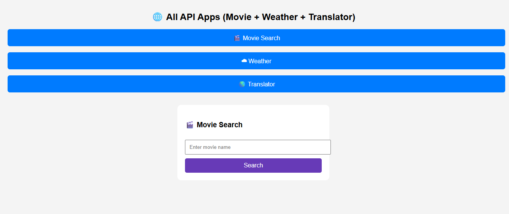
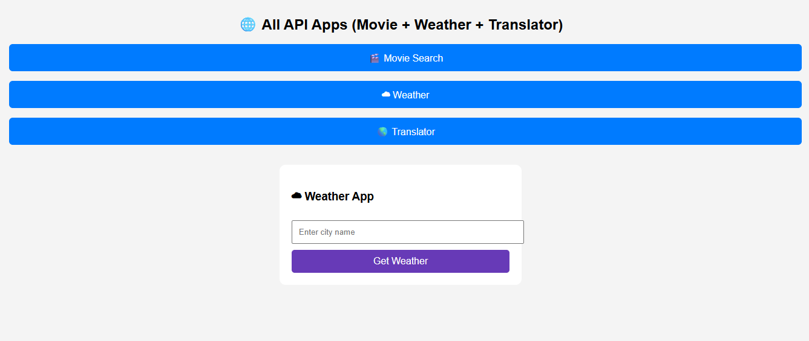
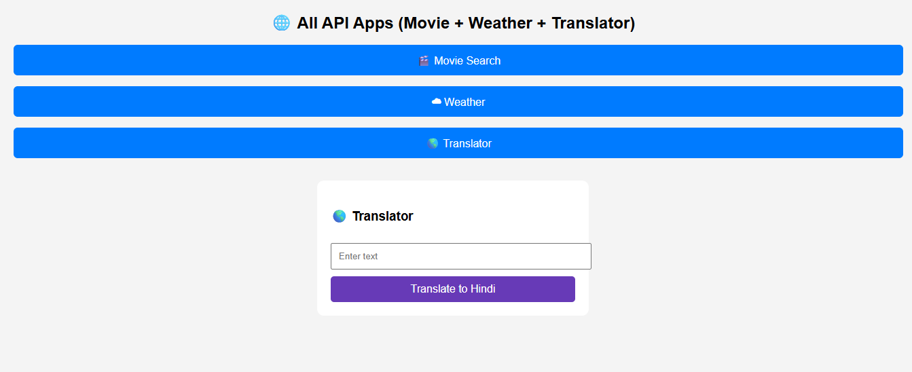

# Web API Apps

A responsive web application that integrates multiple external APIs including Movie Search, Weather Forecast, and Language Translator with real-time data fetching and interactive user experience.

## 🚀 Live Demo
https://rohitsahu-developer.github.io/Web-API-Apps/

---

## 📸 Screenshots

### Movie Search App

### Weather Forecast App

### Text Translator App

---

## 🛠️ Technologies Used
- HTML5
- CSS3
- JavaScript
- REST APIs

---

## ✨ Features
- Real-Time API Data Fetching
- Responsive Design
- Movie Search Functionality
- Weather Information Display
- Multi-Language Text Translation
- Interactive User Interface

---

## 📂 APIs Used
- Movie API
- Weather API
- Translator API

---

## 👨‍💻 Author
Rohit Sahu
